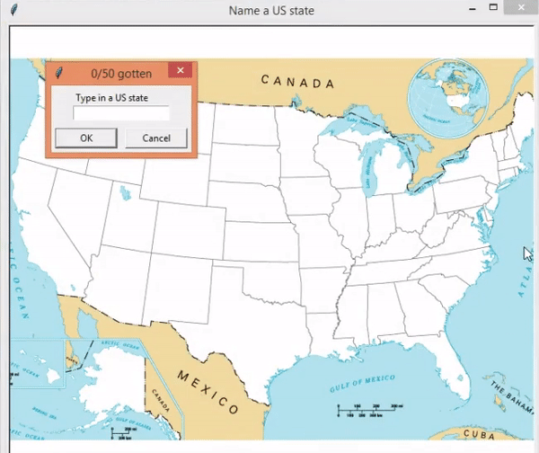

# United-States-Map
Use of Pandas librabry for data analyses

<b /> Contains csv file of all states in the United States

<b /> Prompts player to give a name of a state and locates/displays it in the map. 
If the entered state exists, adds one to the initial number of states correctly inputted.

<b /> If the state does not exists the user has the option to type in a correct state.

<b /> If the user gives up (no more state in the users mind), the user can type in "exit". 
The program will generate a new csv file that contains the name of states of which the user did not mention.

